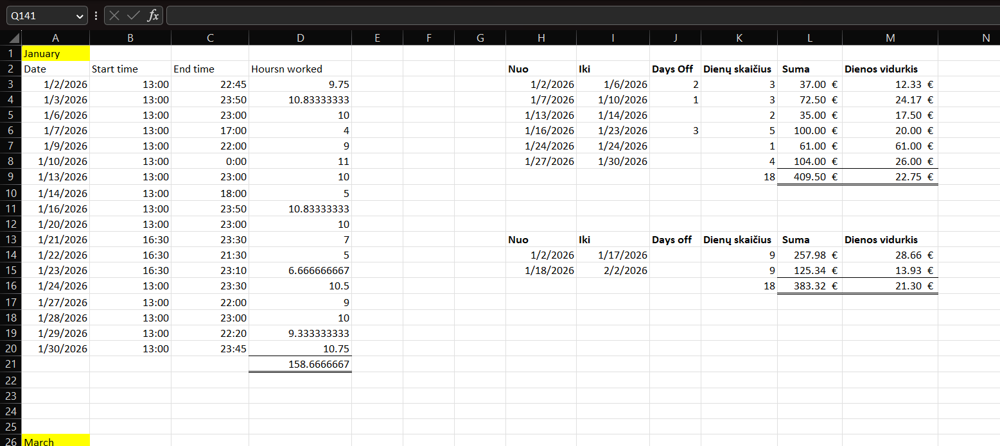

# Work Efficiency Dashboard

## Overview

My income varies significantly from shift to shift and month to month — 
it's made up of a base hourly wage, cash tips, and card tips, and none 
of these are fixed or predictable in isolation. I wanted to understand 
what I actually earn on average, not just guess based on a "good" or 
"bad" shift.

This project tracks daily work data over a full year to answer a few 
specific questions:

- What is my real, effective hourly rate once tips are included — 
  not just my base wage?
- How much of my income comes from salary vs. cash tips vs. card tips?
- Are there predictable seasonal patterns — certain months where I 
  consistently earn more or less, or work more or fewer hours?
- Can I use last year's data to roughly plan or budget for upcoming 
  months, based on the season?

The end goal was to turn a year of scattered daily notes into a single, 
interactive dashboard where I can select any month and immediately see 
the numbers behind it.
## Data Collection (Excel)

### Initial daily log

I started by keeping a simple Excel sheet for daily use — logging 
hours worked, cash tips, and card tips shift by shift. It wasn't 
built with structured analysis in mind, just something quick and 
easy to fill in after each shift, with each month visible on one 
screen without scrolling.

### Restructuring for analysis

Once I had several months of data and knew I wanted to run 
calculations and analysis in SQL, I rebuilt the data into a cleaner 
format, split across three linked sheets in 
[`shift_productivity_data.xlsx`](shift_productivity_data.xlsx):

- **Hours worked** — each shift assigned a unique `shift_id`, so all 
  three sheets could be joined and analyzed together as one dataset.
- **Cash tips** — daily cash tip amounts. Since these were tracked 
  by memory a few days after the shift, human error was a real 
  possibility. To keep the data honest rather than guessing exact 
  figures, I added a `margin_of_error` column — for example, if I 
  only remembered "around €40, maybe €60," I recorded the tip amount 
  along with a €20 margin of error, rather than picking one number 
  and treating it as exact.
- **Card tips** — recorded both before and after tax, so I could see 
  not just what I earned but how much was actually paid to the state.

This structure meant every shift could be traced across all three 
sheets using `shift_id`, which made the SQL joins in the next step 
straightforward.
