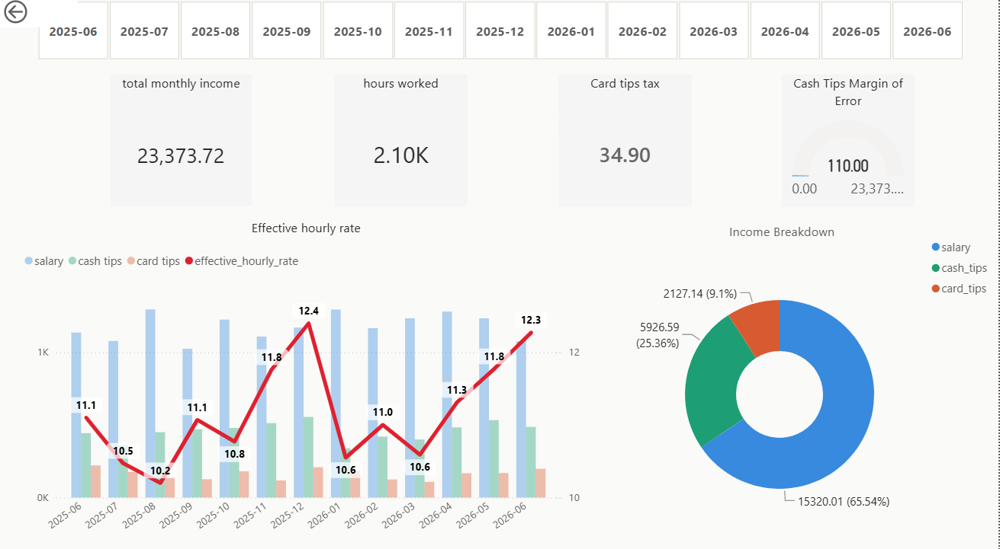

# Work Efficiency Dashboard

## Overview

My income varies significantly from shift to shift and month to month — 
it's made up of a base hourly wage, cash tips, and card tips, and none 
of these are fixed or predictable in isolation. I wanted to understand 
what I actually earn on average, not just guess based on a "good" or 
"bad" shift.

This project tracks daily work data over a full year to answer a few 
specific questions:

- What is my real, effective hourly rate once tips are included — 
  not just my base wage?
- How much of my income comes from salary vs. cash tips vs. card tips?
- Are there predictable seasonal patterns — certain months where I 
  consistently earn more or less, or work more or fewer hours?
- Can I use last year's data to roughly plan or budget for upcoming 
  months, based on the season?

The end goal was to turn a year of scattered daily notes into a single, 
interactive dashboard where I can select any month and immediately see 
the numbers behind it.
## Data Collection (Excel)

### Initial daily log

I started by keeping a simple Excel sheet for daily use — logging 
hours worked, cash tips, and card tips shift by shift. It wasn't 
built with structured analysis in mind, just something quick and 
easy to fill in after each shift, with each month visible on one 
screen without scrolling.

### Restructuring for analysis

Once I had several months of data and knew I wanted to run 
calculations and analysis in SQL, I rebuilt the data into a cleaner 
format, split across three linked sheets in 
[`shift_productivity_data.xlsx`](shift_productivity_data.xlsx):

- **Hours worked** — each shift assigned a unique `shift_id`, so all 
  three sheets could be joined and analyzed together as one dataset.
- **Cash tips** — daily cash tip amounts. Since these were tracked 
  by memory a few days after the shift, human error was a real 
  possibility. To keep the data honest rather than guessing exact 
  figures, I added a `margin_of_error` column — for example, if I 
  only remembered "around €40, maybe €60," I recorded the tip amount 
  along with a €20 margin of error, rather than picking one number 
  and treating it as exact.
- **Card tips** — recorded both before and after tax, so I could see 
  not just what I earned but how much was actually paid to the state.

This structure meant every shift could be traced across all three 
sheets using `shift_id`, which made the SQL joins in the next step 
straightforward.
## Data Processing (SQL)

Once the Excel data was structured with shared `shift_id` values, I 
moved to SQL to join the sheets together and calculate the actual 
metrics behind the raw numbers. Each script ends with a 
`CREATE OR ALTER VIEW`, so the results could be queried directly and 
plugged into Power BI as a clean data source.

### [`monthly_summary.sql`](monthly_summary.sql) — `vw_monthly_income_summary`

Combines hours, base salary, and tips into one monthly view, and 
calculates the effective hourly rate (total income ÷ hours worked).

The base hourly wage changed partway through the year — €7.00 before 
2025-11-01, €7.50 from that date onward — so this is handled directly 
in the query with a `CASE` statement based on the shift date, rather 
than being a fixed number.

| year_month | total_hours_worked | total_base_salary | total_monthly_income | effective_hourly_rate |
|---|---|---|---|---|
| 2025-06 | 162.25 | 1135.75 | 1800.42 | 11.10 |
| 2025-12 | 156 | 1170 | 1933.72 | 12.40 |
| 2026-06 | 143.5 | 1076.25 | 1760.18 | 12.27 |

### [`cash_reliability.sql`](cash_reliability.sql) — `vw_cash_estimation_reliability`

Cash tips were sometimes logged a few days late, from memory. This 
view separates exact vs. estimated shifts each month and totals the 
`margin_of_error` I recorded whenever I wasn't fully sure of the exact 
amount — so the data stays honest about its own uncertainty instead 
of presenting estimated figures as if they were exact.
## Visualization (Power BI)

The three SQL views were connected to Power BI, where I built an 
interactive dashboard with a month slicer at the top, so I can select 
any single month (or several) and see the numbers update instantly.

The dashboard is available as a full interactive file: 
[`Analyzing_Work_Efficiency.pbix`](Analyzing_Work_Efficiency.pbix) 
(requires Power BI Desktop to open).

**What each visual shows:**
- **Total monthly income / Hours worked / Card tips tax / Cash Tips 
  Margin of Error** — top-level KPI cards for the selected period.
- **Effective hourly rate** — a combo chart comparing salary, cash 
  tips, and card tips per month against the calculated effective 
  hourly rate line, making it easy to see how tips lift real earnings 
  above the base wage.
- **Income Breakdown** — a donut chart showing what share of total 
  income comes from salary vs. cash tips vs. card tips.

### [`tips_distribution.sql`](tips_distribution.sql) — `vw_tips_distribution`

Breaks down total tips each month into the cash vs. card share, as a 
percentage — useful for seeing how payment habits shift over time 
(e.g. more card tips as cashless payments become more common).

## Key Insights

- The effective hourly rate ranged from €10.2 to €12.4 across the 
  year — meaning tips consistently added at least €3–5 per hour on 
  top of the €7.00/€7.50 base wage.
- Salary makes up the majority of income (65.5%), but tips combined 
  (cash + card) still account for over a third of total earnings 
  (34.5%) — a meaningful share that base salary alone doesn't capture.
- Cash tips (25.4%) remain notably larger than card tips (9.1%), 
  though this is worth monitoring over time as cashless payments 
  become more common.
